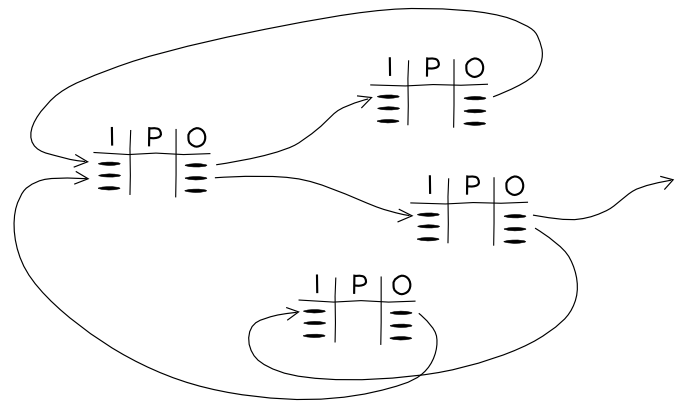

## Agents

Agents are [holons](/life-as-a-holon).

## Resources

Resources are all the things.

## Planning

Planning is our ability to describe process before we do

### IPO tables

> The idea in the center of IPO is to take the simple standard of the IPO Model – Input, Process, Output – that is widely used in system-analysis and life cycle assessment (LCA)/eco-management (e.g. ISO 14040) and bring it to the world of open-source-hardware documentation. In life-cycle-assessment complex production processes are broken down in simpler and manageable steps – modules. Every module has 1) INPUTS like materials, components & energy, 2) PROCESSES that transform inputs into outputs and 3) OUTPUTS like products and byproducts. I-P-O modules. Listing all outputs makes waste visible and is a pre-step to connect outputs to input-sides, to connect modules to chains (and maybe circles).
>
> -- http://ipotables.net/

## Process
