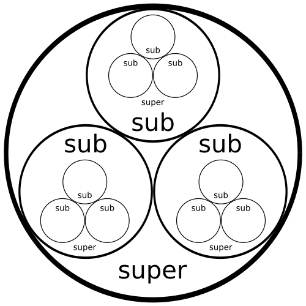

layout: post
title: Holonic systems
date: 2015-01-04T00:47:24.135Z
updated: 2015-04-21T12:46:17.906Z
---

[Holons](./life-as-a-holon) are fractal networks of agents, with some beautiful and powerful properties.

## Definitions

### What is a holon

[Holons](./life-as-a-holon) in a [multi-agent system](https://en.wikipedia.org/wiki/Multi-agent_system) are defined as follows:

- Every holon is a superholon of a set of subholons.

TODO: need to automate the creation of holon diagrams

- The head of a holon are subholons which represent the holon to the external environment.
- The body of a holon are subholons which are not allowed to represent the holon.
- Each holon has a set of commmitments that defines the relationship inside the holon and is agreed on by all subholons at the time of joining the holon.
- Holons are allowed to engage as subholons in several different holons at the same time, as long as this doesn't contradict the sets of commitments of these superholons.

A holon is observed by its environment like any other agent. Only at closer inspection may it turn out that a holon is constructred from a set of agents, which may also consist of subholons. As any head of a holon has a unique identification, it is possible to communicate with each holon by sending messages to their addresses. As long as subholons intend to keep their commitments and as long as subholons do not make conflicting commitments, cycles in holon memberships are possible.

### Properties of holons

- A task holon is a holon that is generated to perform only a single task.  This notion is opposed to organisational holons, which are designed to perform a series of jobs.
- Delegation of tasks between two subholons h1 and h2 of a holon h as part of working towards the goal of h is called intra-holon delegation.  If two holons delegate tasks and this collaboration is not part of the goal of an encompassing holon, this is called inter-holon delegation.
- A holon that is composed of subholons with identical ability types is called a homogeneous holon. If abilities are different, the holon is called a heterogeneous holon.
- Furthermore, we distinguish active and passive holons. An active holon is a holon that has already been created, that has bound its subholons by commitment to the holonic structure, and that has not yet been terminated. Once it has been terminated and when it exists only in the memory of the population, the structure is called a passive holon.
- Active holons are divided into manifest and latent holons. If the sub-holons committed to participate in the holon, and are committed to dedicate, or actually have dedicated resources to it, or are performing actions specifically in pursuit of the holons goals, the holon is called manifest. If the holon is not terminated and is not currently influencing a subholon’s actions, it is called latent. In contrast to passive holons, latent holons can be activated instantaneously as there is still a commitment of the subholons to participate in the holon in principle.
- Finally, a holon that is not atomic is called a holarchy. A holarchy of which all nested subholons have only a single head holon, i.e. a holarchy with a tree-like structure, is called a hierarchical holarchy.  The advantages of the holonic concept are threefold. First, this technology preserves compatibility to multiagent systems by addressing every holon as an agent, whether this agent represents a set of agents or not, is encapsulated. Second, as every agent may or may not represent a larger holon, holonic multiagent systems are a way of introducing recursion to the modelling of multiagent systems, which has proven to be a powerful mechanism in software design to deal with complexity. Third, the concept does not restrict us to a specified type of association between the agents, so it leaves room to introduce organisational concepts at this point. To depict a system of holons, we choose to define a novel type of diagram called holon diagram. A holon diagram is similar to a Venn diagram in that it highlights 122 6. FORM - A Framework for Multiagent Organisation and Agent Autonomy the relationships between the sets of subholons, but it also includes some annotations that clarify names, resources and holon goals.

## Spectrum of holons

## Resources

- [Multiagent Robustness: Authonomy vs. Organisation](http://www.researchgate.net/publication/235424370_Multiagent_Robustness_Autonomy_vs._Organisation/file/d912f511621b522bea.pdf)
